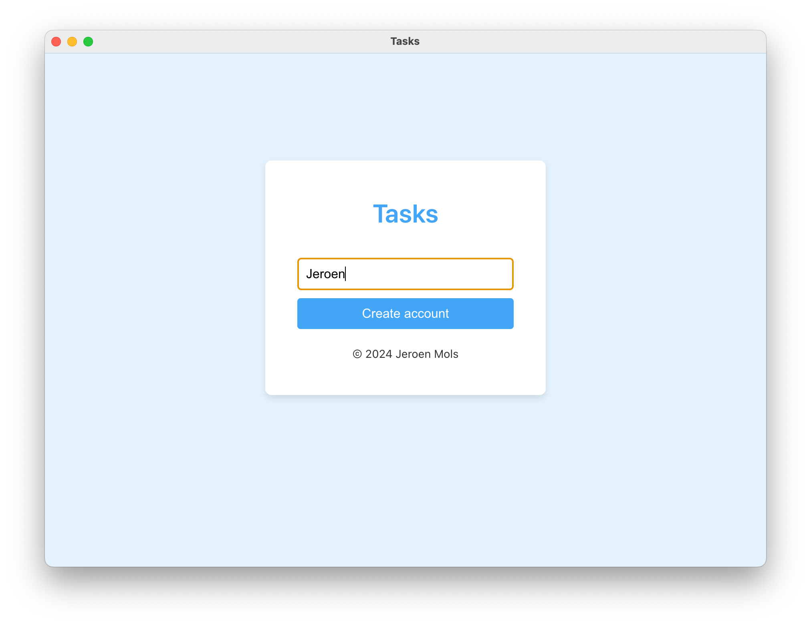
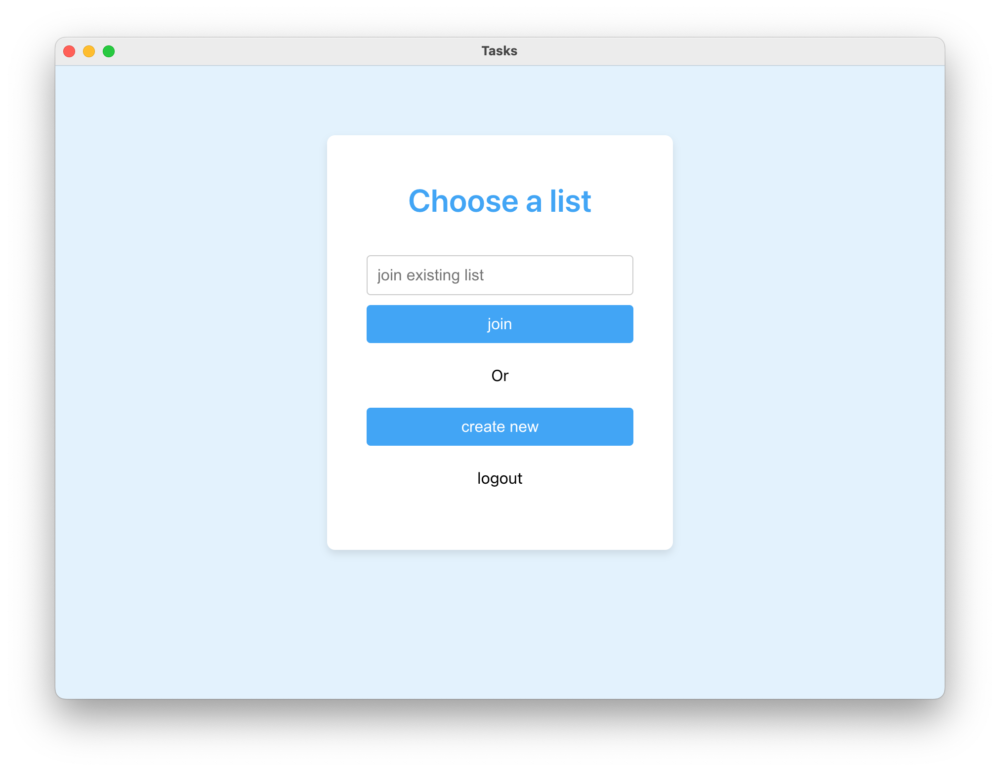
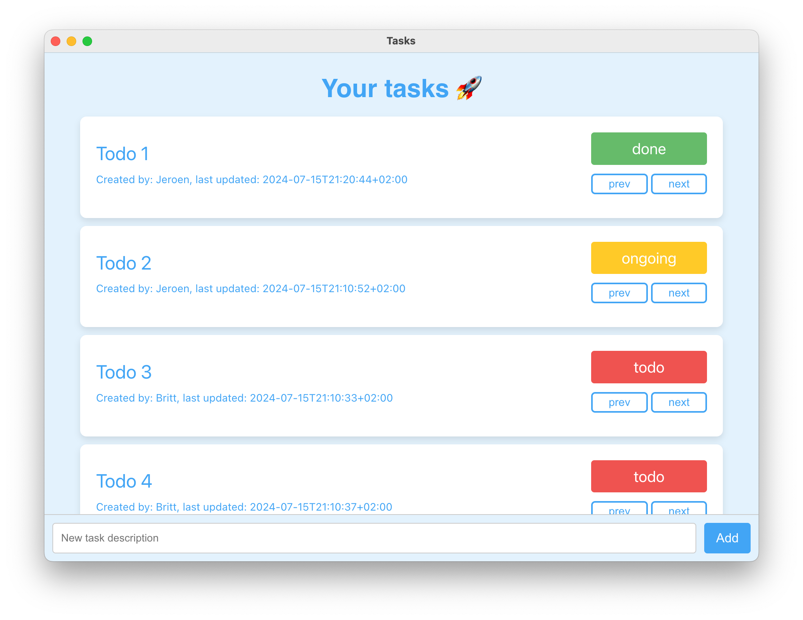

# Tasks
A simple Todo list manager consisting out of a Go backend and Electron frontend app.

## Getting started
- Backend (`cd ./backend`)
  - install Go `brew install go`
  - run server: `./start_server.sh`
  - run tests: `go test ./...`

- Frontend (`cd ./frontend`)
  - install [Node.js](https://nodejs.org/en/download/package-manager)
  - run app: `npm install && npm run dev`
  - run unit tests: `npm run test:unit`
  - run end 2 end tests: `npm run test:e2e`

Note that the frontend must run on http://localhost:5173/ and the backend on http://localhost:8080/

## Key design choices
The backend is written in [Go](https://go.dev/), using a simple in-memory database. 

- Go, because it's a fast typed language that synchronously handles database and network requests (e.g. Node [ExpressJs](https://expressjs.com/) does that asnchronous). This was also an opportunity to better learn Go, instead of using Ruby.
- In-memory database, because it reduces setup time and makes it easy to write tests. It's abstracted by a `Database` interface to make it easy to swap to a real database later.
- Endpoints are authenticated using tokens in a Authorization header (requiring CORS)

> ⚠️ when restarting the server, all data stored in the database is lost!

The frontend is an [Electron](https://www.electronjs.org/) app written in [Svelte](https://svelte.dev/), using [Typescript](https://www.typescriptlang.org/) and [Vite](https://vitejs.dev/).

- [Svelte](https://svelte.dev/), because I already knew React and wanted to learn something new
- [Vite](https://vitejs.dev/), to have the fastest possible developer experience
- [PlayWright](https://playwright.dev/), for end 2 end tests (unfortunately [the trace viewer](https://playwright.dev/docs/trace-viewer-intro) does not work on [Electron](https://www.electronjs.org/))
- [Vitest](https://vitest.dev/), for unit tests
- Other tools include: [Typescript](https://www.typescriptlang.org/), EsLint and Prettier

After creating a user, an access token is written to local storage and reused until `logout` is pressed.

## Tips and tricks

- `cmd + R` to return to the choose list screen
- Inspect the backend database: `curl http://localhost:8080/debug | jq`
- Restart server to clear the database
- End 2 end tests write a HTML report to `frontend/playwright-report` and screenshots to `screenshots`

## Screenshots

